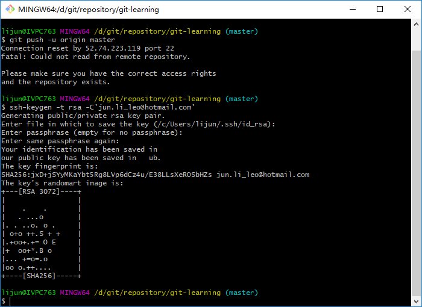
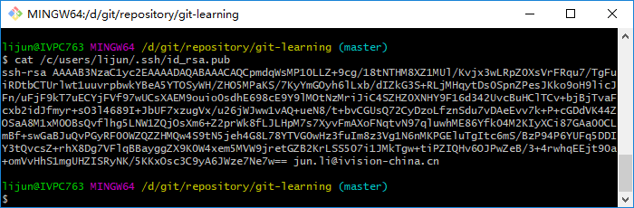
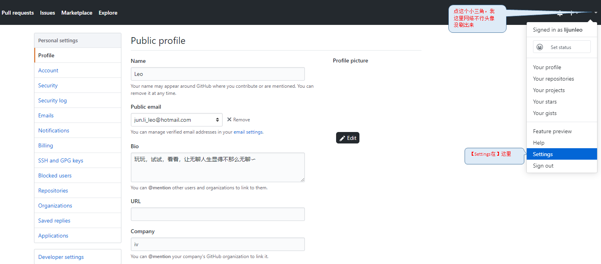
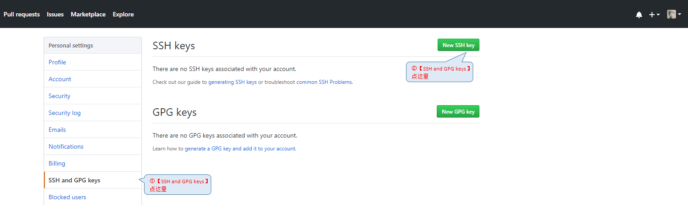
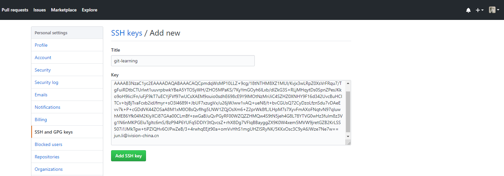
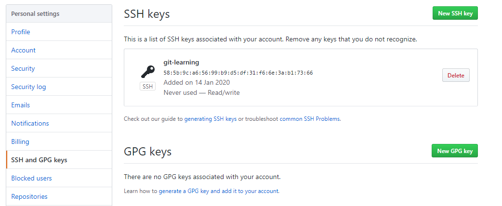

## 远程仓库
到目前为止，我们已经掌握了如何在Git仓库里对一个文件进行时光穿梭，你再也不用担心文件备份或者丢失的问题了。

可是有用过集中式版本控制系统SVN的童鞋会站出来说，这些功能在SVN里早就有了，没有看出Git有什么特别的地方。

没错，如果只是一个仓库里管理文件历史，Git和SVN真的没啥区别。为了保证你现在所学的Git物超所值，将来绝对不会后悔，同事为了打击已经不幸学了SVN的童鞋，本章开始介绍Git的杀手级功能之一（注意是之一，也就是后面还有之二，之三……）：远程仓库。

Git是分布式版本控制系统，同一个Git仓库，可以分布到不同的机器上。怎么分布呢？最早，肯定只有一台机器有一个原始版本库，伺候，别的机器可以“克隆”这个原始版本库，而且每台机器的版本库其实都是一样的，并没有主次之分。

你肯定会项，至少需要两台机器才能玩远程库不是么？但是我只有一台电脑，怎么玩？

其实一台电脑上也是可以克隆多个版本库的，只要不在同一个目录下。不过，现实生活中是不会有人这么傻的在一台电脑上搞几个远程库玩。

实际情况往往是这样，找一台电脑充当服务器角色，每天24小时开机，其他每个人都从这个“服务器”仓库克隆一份到自己的电脑上，并且各自把各自的提交推送到服务器仓库里，也从服务器仓库中拉取别人的提交。

完全可以自己搭建一台运行Git的服务器，不过现阶段，为了学Git先搭个Git服务器绝对是小题大做。好在这个世界上有一个叫GitHub的神奇网站，从名字就可以看出，这个网站就是提供Git仓库托管服务的，所以，只要注册一个GitHub账号，就可以免费获得Git远程仓库。

在继续阅读后续内容前，请自行注册GitHub账号。由于你的本地Git仓库和GitHub仓库之间的传输是通过SSH加密的，所以，需要一点设置：

- 第1步：创建SSH Key。在用户主目录下，看看有没有.ssh目录，如果有，再看看这个目录下有没有<font color="red">id_rsa</font>和<font color="red">id_rsa.pub</font>这两个文件，如果已经有了，可直接跳到下一步。如果没有，打开Shell（Windows下打开Git Bash），创建SSH Key：
```bash
$ ssh-keygen -t rsa -C'youremail@example.com'
```
你需要把邮件地址换成你自己的邮件地址，然后一路回车，使用默认值即可，由于这个Key也不是用于军事目的，所以也无需设置密码。   
   
如果一切顺利的话，可以在**用户主目录**(C:/users/name/.ssh/ide_rsa)里找到<font color="red">.ssh</font>的文件夹，里面有<font color="red">id_rsa</font>和<font color="red">id_rsa.pub</font>两个文件，这两个就是SSH Key的密钥对，<font color="red">id_rsa</font>是私钥，不能泄露出去，<font color="red">id_rsa.pub</font>是公钥可以放心的告诉别人~

- 第2步：我们通过命令【cat /c/users/name/.ssh/id_rsa.pub】，在你的用户主目录里输出<font color="red">id_rsa.pub</font>这个文件内容，将ssh-rsa一起到最后你邮箱处整个字符串复制：
```bash
$ cat /c/users/lijun/.ssh/id_rsa.pub
ssh-rsa AAAAB3NzaC1yc2EAAAADAQABAAACAQCpmdqWsMP10LLZ+9cg/18tNTHM8XZ1MUl/Kvjx3wLRpZ0XsVrFRqu7/TgFuiRDtbCTUrlwt1uuvrpbwkYBeA5YTOSyWH/ZHO5MPaKS/7KyYmGOyh6lLxb/dIZkG3S+RLjMHqytDs0SpnZPesJKko9oH9licJFn/uFjF9kT7uECYjFVf97wUCsXAEM9ouio0sdhE698cE9Y9lMOtNzMriJiC4SZHZ0XNHY9F16d342UvcBuHClTCv+bjBjTvaFcxb2idJfmyr+sO3l4689I+JbUF7xzugVx/u26jWJww1vAQ+ueN8/t+bvCGUsQ72CyDzoLfznSdu7vDAeEvv7k+P+cGDdVK44ZOSaA8M1xM0OBsQvflhg5LNW1ZQjOsXm6+Z2prWk8fLJLHpM7s7XyvFmAXoFNqtvN97qluwhME86Yfk04M2KIyXCi87GAa00CLmBf+swGaBJuQvPGyRF00WZQZZHMQw4S9tN5jeh4G8L78YTVG0wHz3fuIm8z3Vg1N6nMKPGEluTgItc6mS/BzP94P6YUFq5DDIY3tQvcsZ+rhX8Dg7VFlqBBayggZX9K0W4xem5MVW9jretGZB2KrLSS507i1JMkTgw+tiPZIQHv6OJPwZeB/3+4rwhqEEjt90a+omVvHhS1mgUHZISRyNK/5KKxOsc3C9yA6JWze7Ne7w== jun.li@ivision-china.cn
```
 

接下来按照下面的步骤在GitHub上操作：

1. GitHub上点击Settings：

2. 选择左侧菜单【SSH and GPG Keys】，然后单击【New SSH Key】：

3. 填上任意Title，在Key文本框里黏贴上述<font color="red">id_rsa.pub</font>文件里的内容：

4. 返回的页面显示我们已经添加的SSH Key：


为什么GitHub需要SSH Key呢？因为GitHub需要识别出你推送的提交确实是你推送的，而不是别人冒充的，而Git支持SSH协议，所以，GitHub只要知道了你的公钥，就可以确认只有你自己才能推送。

当然，GitHub允许你添加多个Key。假定你有若干电脑，你一会儿在公司提交，一会儿在家里提交，只要把每台电脑Key都添加到GitHub，就可以在每台电脑上往GitHub上推送了。

最后友情提示，在GitHub上免费托管的Git仓库，任何人都可以看到喔（但只有你自己能改）。所以，不要把敏感信息放进去。

如果你不想让别人看到Git库，有两个办法，一个是交点保护费，让GitHub把公开的仓库变成私有的，这样别人就看不见了（不可读更不可写）。另一个办法是自己动手，搭一个Git服务器，因为是你自己的Git服务器，所以别人也是看不见的。这个方法我们后面会讲到的，相当简单，公司内部开发必备。

确保你有一个GitHub账号之后，我们就即将开始远程仓库的学习。

### 小结
“有了远程仓库，妈妈再也不用担心我的硬盘了”  -- Git点读机。 