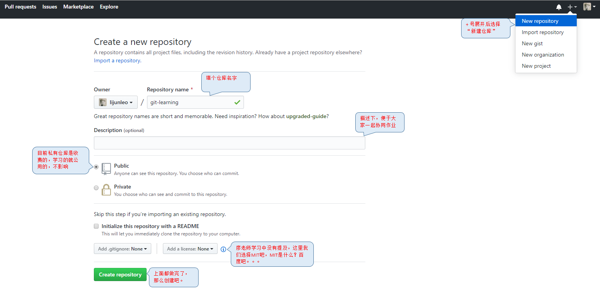
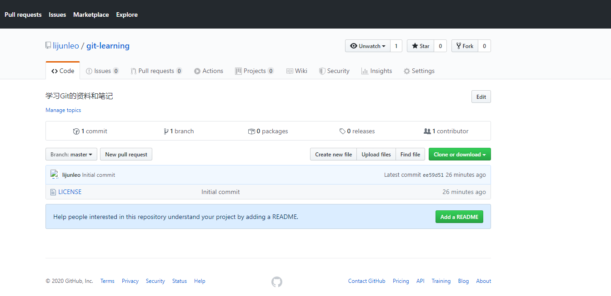
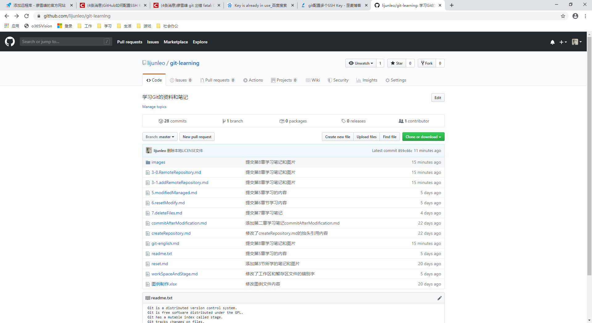

## 添加远程仓库
现在的情景是，你已经在本地创建了一个Git仓库后，又想在GitHub上创建一个Git仓库，并且让这两个仓库进行远程同步。这样，GitHub上的仓库既可以作为备份，又可以让其他人通过该仓库来协作，真是一举多得。   
首先，登录GitHub，然后，在右上角找到“New repository”按钮，创建1个新的仓库：
   
在填写完图片里的提示的内容后，点击Create repository按钮，就成功地创建了一个新的Git仓库：
   
>Git提示我们为这个仓库创建1个README文件帮助大家理解这个项目，或对这个项目感兴趣的人找到这个项目。

目前，在GitHub上的这个<font color="red">`git-learning`</font>仓库还是空的，GitHub告诉我们，可以从这个仓库克隆出新的仓库（Clone or download），也可以把一个已有的本地仓库与之关联，然后，把本地仓库的内容推送到GitHub仓库。   
现在，我们根据GitHub的提示，在本地的<font color="red">`git-learning`</font>仓库下运行命令：
```bash
$ git remote add origin git@github.com:lijunleo/git-learning.git
```
请千万要注意，把上面的<font color="red">`lijunleo`</font>替换成你自己的GitHub账户名，否则，你在本地关联的就是我的远程库，关联没有问题，但是你以后推送是推不上去的，因为你的<font color="red">`SSH Key`</font>公钥不在我的账户列表中。   
添加后，远程库的名字就是<font color="red">`origin`</font>，这是Git的默认叫法，也可以改成别的，但是<font color="red">`origin`</font>这个名字一看就知道是远程库。

下一步，就可以把本地库的所有内容推送到远程库上：
```bash
$ git push -u origin master
Enumerating objects: 115, done.
Counting objects: 100% (115/115), done.
Delta compression using up to 4 threads
Compressing objects: 100% (111/111), done.
Writing objects: 100% (113/113), 776.92 KiB | 4.62 MiB/s, done.
Total 113 (delta 39), reused 0 (delta 0)
remote: Resolving deltas: 100% (39/39), done.
To github.com:lijunleo/git-learning.git
   ee59d51..859c66c  master -> master
Branch 'master' set up to track remote branch 'master' from 'origin'.
```
把本次仓库推送到远程，用<font color="red">`git push`</font>命令，实际上是把当前分支<font color="red">`master`</font>推送到远程。

由于远程库是空的，我们第一次推送<font color="red">`master`</font>分支时，加上了<font color="red">`-u`</font>参数，Git不但会把本地的<font color="red">`master`</font>分支内容推送到远程新的<font color="red">`master`</font>分支，还会把<font color="red">`master`</font>分支和远程的<font color="red">`master`</font>分支关联起来，在以后的推送或者拉取时就可以简化命令。

推送成功后，可以立刻在GitHub页面中看到远程库的内容已经和本地一模一样了：


从现在起，只要本地作了提交，就可以通过命令：
```bash
$ git push origin master
```
把本地<font color="red">`master`</font>分支的最新修改推送至GitHub，现在，你就拥有了真正的分布式版本库！

### SSH 警告
当你第一次使用Git的<font color="red">`clone`</font>或者<font color="red">`push`</font>命令链接GitHub时，会得到一个警告：
```bash
The authenticity of host 'github.com (xx.xx.xx.xx)' can't be established.
RSA key fingerprint is xx.xx.xx.xx.xx.
Are you sure you want to continue connecting (yes/no)?
```
这是因为Git使用SSH链接，而SSH链接在第一次验证GitHub服务器的Key时，需要你确认GitHub的Key的指纹信息是否真的来自GitHub的服务器，输入<font color="red">`yes`</font>回车即可。
Git会输出一个警告，告诉你已经把GitHub的Key添加到本机的一个新人列表里了：
```bash
Warning: Permanently added 'github.com' (RSA) to the list of known hosts.
```
这个警告只会出现一次，后面的操作就不会有任何警告了。   
如果你实在担心有人冒充GitHub服务器，输入<font color="red">`yes`</font>前可以对照<font color="blue">`GitHub的RSA Key的指纹信息`</font>是否与SSH连接给出的一致。

### 小结
要关联一个远程库，使用命令<font color="red">`git remote add origin git@server-name:path/repo-name.git`</font>；   
关联后，使用命令<font color="red">`git push -u origin master`</font>第一次推送master分支的所有内容；   
伺候，每次本地提交后，只要有必要，就可以使用命令<font color="red">`git push origin master`</font>推送最新修改；   
分布式版本系统的最大好处之一是在本地工作完全不需要考虑远程库的存在，也就是有没有联网都可以正常工作，而SVN在没有联网的时候是拒绝干活的！当有网络的时候，再把本地提交推送改一下就完成了同步，真是太方便了！
