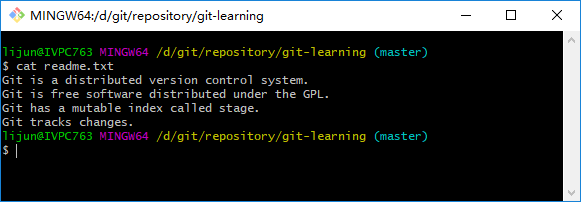

## 管理修改
现在，假定你已经完全掌握了暂存区的概念。下面，我们要讨论的就是，为什么Git比其他版本控制系统设计得优秀？因为Git跟踪并管理的是修改，而非文件。   
你会问，什么是修改？比如你新增了一行，这就是一个修改，删除了一行，也是一个修改，删了一些又加了一些，也是一个修改，甚至创建一个新文件，也算一个修改。   
为什么说Git管理的是修改，而不是文件呢？我们还是做做实验，第一步，对readme.txt做一个修改，比如加一行内容：
```bash
$ cat readme.txt
Git is a distributed version control system.
Git is free software distributed under the GPL.
Git has a mutable index called stage.
Git tracks changes.
```
追加文言<font color="green">Git tracks changes.</font>如下图：   
   
然后添加：
```bash
$ git add readme.txt
$ git status
# On branch master
# Changes to be committed:
#   (use "git reset HEAD <file>..." to unstage)
#
#       modified:   readme.txt
#
```
然后再修改`readme.txt`
```bash
$ cat readme.txt
Git is a distributed version control system.
Git is free software distributed under the GPL.
Git has a mutable index called stage.
Git tracks changes on files.
```
提交：
```bash
$ git commit -m'git tracks changes'
[master 16eba33] git tracks changes
 1 file changed, 2 insertions(+), 1 deletion(-)
```
提交之后再看状态：
```bash
$ git status
On branch master
Changes not staged for commit:
  (use "git add <file>..." to update what will be committed)
  (use "git checkout -- <file>..." to discard changes in working directory)

    modified:   readme.txt

no changes added to commit (use "git add" and/or "git commit -a")
```
咦，怎么第二次的修改没有被提交呢？   
别激动，我们回顾下操作过程：
第一次修改 → <font color="red">git add</font>  → 第二次修改  → <font color="red">git commit</font>   
你看，我们前面讲过了，**Git管理的是修改**，当你用<font color="red">`git add`</font>命令后，在工作区的第一次修改被放入暂存区。准备提交，但是，在工作区的第二次修改并没有放入暂存区，所以，<font color="red">`git commit`</font>只负责把暂存区的修改提交了，也就是第一次的修改被提交了，第二次的修改不会被提交。   
提交后，用<font color="red">`git diff HEAD -- readme.txt`</font>命令可以查看工作区和版本库里最新版本的区别：
```bash
$ git diff HEAD -- readme.txt
diff --git a/readme.txt b/readme.txt
index db28b2c..d90590a 100644
--- a/readme.txt
+++ b/readme.txt
@@ -1,4 +1,4 @@
 Git is a distributed version control system.
 Git is free software distributed under the GPL.
 Git has a mutable index called stage.
-Git tracks changes.
\ No newline at end of file
+Git tracks changes on files.
\ No newline at end of file
```
可见第二次的修改并没有被提交！   
那么怎么提交第二次的修改呢？你可以继续<font color="red">`git add`</font>再<font color="red">`git commit`</font>，也可以别着急提交第一次修改，先<font color="red">`git add`</font>第二次修改，在<font color="red">`git commit`</font>，就相当于把两次修改合并后一块提交了：   
第一次修改 → <font color="red">`git add`</font> → 第二次修改 → <font color="red">`git add`</font> → <font color="red">`git commit`</font>   

好，现在，吧第二次修改提交了，然后开始小结。

### 小结
现在，你又理解了Git是如何跟踪修改的，每次修改如果不用<font color="red">`git add`</font>到暂存区，那就不会加入到<font color="red">`commit`</font>中。