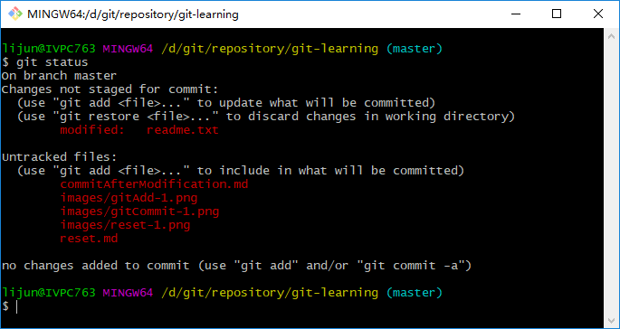
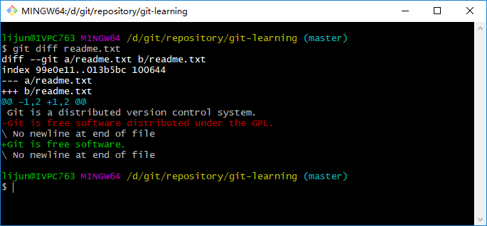
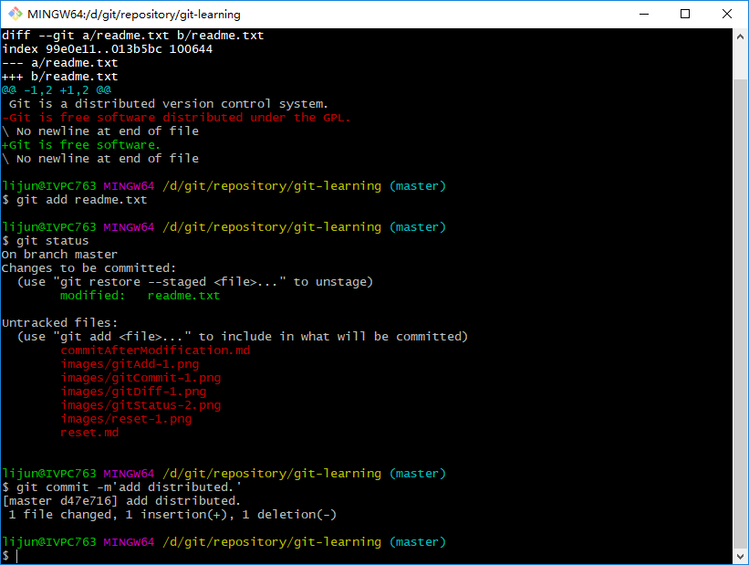

>以下内容均出自[廖雪峰老师的学习网站](https://www.liaoxuefeng.com/)，如有侵权请指出我将立即删除。
>下列资料将作为自学用所记录的笔记，不作为商用，如有转载请明示，谢谢!  

## 时光穿梭机
现在，我们已经成功地添加并提交了一个readme.txt文件。现在，是时候继续工作了，于是，我们继续修改readme.txt文件，修改如下：   
```html
Git is a distributed version control system.
Git is free software.
```
现在，运行<font color="red">`git status`</font>命令看看结果：
```bash
$ git status
On branch master
Changes not staged for commit:
  (use "git add <file>..." to update what will be committed)
  (use "git restore <file>..." to discard changes in working directory)
        modified:   readme.txt

no changes added to commit (use "git add" and/or "git commit -a")
```
<font color="green">`git bash`</font>中显示如下：   
   
<font color="red">`git status`</font>命令可以让我们时刻掌握仓库当前的状态，上面的命令输出告诉我们，<font color="red">`readme.txt`</font>文件被修改过了，但还没有准备提交的修改。   

虽然Git告诉我们<font color="red">`readme.txt`</font>文件被修改了，但如果能看看具体修改了什么内容，自然是很好打。比如你休假两周从国外回来，第一天上班时，已经记不清上次怎么修改的<font color="red">`readme.txt`</font>文件，所以，需要使用命令<font color="red">`git diff`</font>这个命令看看：   
```bash
$ git diff readme.txt
diff --git a/readme.txt b/readme.txt
index 99e0e11..013b5bc 100644
--- a/readme.txt
+++ b/readme.txt
@@ -1,2 +1,2 @@
 Git is a distributed version control system.
-Git is free software distributed under the GPL.
\ No newline at end of file
+Git is free software.
\ No newline at end of file

```
   
<font color="red">`git diff`</font>顾名思义就是查看difference，显示的格式正式Unix通用的diff格式，可以从上面的命令输出看到，我们删除了`Git is free software distributed under the GPL.`文字，然后添加了`Git is free software.`   

知道对<font color="red">`readme.txt`</font>文件作了什么修改后，再把它提交到仓库就放心多了，提交修改和提交新文件是一样的两步，第一步是<font color="red">`git add`</font>:
```bash
$ git add readme.txt
```
同样没有任何输出。在执行第二步<font color="red">`git commit`</font>之前，我们再运行<font color="red">`git status`</font>看看当前仓库的状态：
```bash
$ git status
On branch master
Changes to be committed:
  (use "git restore --staged <file>..." to unstage)
        modified:   readme.txt

```
   
<font color="red">`git status`</font>告诉我们，将要被提交的修改包括<font color="red">`readme.txt`</font>文件，下一步，就可以放心的提交了：
```bash
$ git commit -m'add distributed.'
[master d47e716] add distributed.
 1 file changed, 1 insertion(+), 1 deletion(-)
```
   

提交后，我们在用<font color="red">`git status`</font>命令看看仓库的当前状态：
```bash
$ git status
On branch master
nothing to commit, working tree clean
```
Git告诉我们当前没有需要提交的修改，而且，工作目录是干净（working tree clean）的。   

### 小结
- 要随时掌握工作区的状态，使用<font color="red">`git status`</font>命令。
- 如果<font color="red">`git status`</font>命令告诉我们有文件被修改过，则使用<font color="red">`git diff <file>`</font>命令查看修改内容。