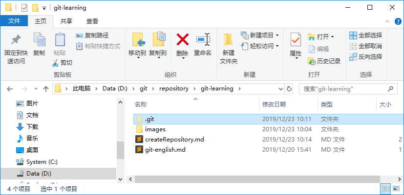

>以下内容均出自廖雪峰老师的学习网站，如有侵权请指出我将立即删除。[廖老师的官网](https://www.liaoxuefeng.com/)。
>下列资料将作为自学用所记录的笔记，不作为商用，如有转载请明示，谢谢。   

## 版本库
什么是版本库？版本库又名仓库，英文名**repository**，你可以简单理解成一个目录，这个目录里面的所有文件都可以被Git管理起来，每个文件的修改、删除，Git都能跟踪，以便任何时刻都可以追踪历史，或者在将来某个时刻可以被“还原”。   

### 创建版本库
1. 常见版本库非常的简单。首先，选择一个合适的地方，创建一个空目录（我是windows系统）。我在D盘符中创建了新文件夹【git-learning】，如下图：   
      

2. 通过命令【<font color="red">`git init`</font>】把这个目录变成Git可以管理的仓库：
```bash
$git init
Initialized empty Git repository in D:/git/repository/git-learning/.git/
```
这样我们就把Git的仓库建好了，而且提示你是一个空的仓库（empty Git repository），我们可以切换到当前目录“git-learning”下直接查看，确认到目录下多了一个<font color="red">`.git`</font>的目录，这个目录是Git来跟踪管理版本库的，没事千万不要手动修改这个目录里的文件，不然改乱了，就把Git仓库给破坏了。   
      

3. 在<font color="green">`git bash`</font>下使用命令<font color=red>`pwd`</font>：用于显示当前目录。在我的windows电脑上，这个仓库就位于<font color="red">`/d/git/repository/git-learning`</font>下：   
   

4. 如果你没有看到<font color="red">`.git`</font>的目录，那是因为你这个目录默认是隐藏的，用命令<font color="red">`ls -ah`</font>就可以看见：   
   
***其他：***我个人常用命令<font color="red">`ls -al`</font>，她会显示更为详细的目录和文件的信息，包括创建者和时间：   
   

<font color="red">***！！！请注意！！！：***</font>不一定必须在空目录下创建Git的仓库，选择一个已经有东西的目录也是可以的。不过，不建议你使用自己正在开发的公司项目来学习Git，否则造成的一切后果概不负责。   

### 版本库中添加项目文件
**提示：**所有的版本控制系统，其实只能跟中文本文件的改动，比如TXT文件、网页、所有的程序代码等等，Git也不例外。版本控制系统可以告诉你每次的改动，比如在第5行里加了1个单词"Linux"，在第8行删了一个单词“windows”。而图片，视频这些二进制文件，虽然也能由版本控制系统管理，但没法跟踪文件的变化，只能把二进制文件每次改动串起来，也就是只知道团偏从100KB改成了120KB，但是到底改了啥，版本控制系统也不知道，也无法知道。      

<font color="red">不幸的是：</font>Microsoft的Word格式是二进制格式。因此，版本控制系统没法跟踪Word文件的改动的，前面我们举例只是为了演示，如果要真正使用版本控制系统，就要以纯文本方式编写文件。      

1. 现在我们在<font color="red">`git-learning`</font>目录下编写一个<font color="red">`readme.txt`</font>文件，内容如下：   
```bash
Git is a version control system.
Git is free software.
```
**请注意：**文件一定要在目录<font color="red">`git-learning`</font>下（子目录也行），因为这是一个Git仓库，方到其他地方Git再厉害也找不到这个文件！

2. 创建好文件<font color="red">`readme.txt`</font>后，我们通过命令<font color="red">`git add`</font>来告诉Git，把这个文件添加到仓库：   
```bash
$ git add readme.txt
```

3. 