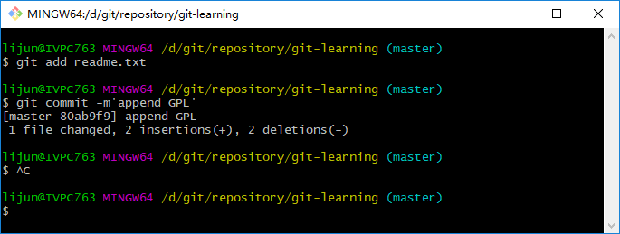
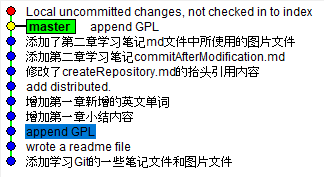
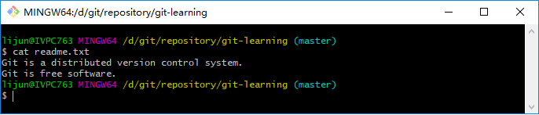
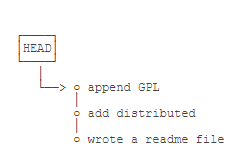
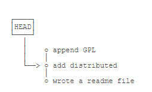

>以下内容均出自[廖雪峰老师的学习网站](https://www.liaoxuefeng.com/)，如有侵权请指出我将立即删除。
>下列资料将作为自学用所记录的笔记，不作为商用，如有转载请明示，谢谢!  

## 版本回退
现在，我们已经经学会了修改文件，然后把修改的文件提交到Git版本库，现在，再联系一次，修改`readme.txt`文件如下：
```bash
Git is a distributed version control system.
Git is free software distributed under the GPL.
```
然后尝试提交：
```bash
$ git add readme.txt
$ git commit -m'append GPL'
[master 80ab9f9] append GPL
 1 file changed, 2 insertions(+), 2 deletions(-)
```
   
像这样，你不断对文件进行修改，然后不断提交修改到版本库里，就好比玩RPG游戏时，每通过一关就会自动把游戏状态存盘，如果某一关没有过去，你还可以选择读取前一关的状态。有些时候，在打Boss之前，你会手动存盘，以便万一打Boss失败了，可以从最近的地方重新开始。Git也是一样，每当你觉得文件修改到一定程度的时候，就可以“保存一个快照”，这个快照在Git中被称为<font color="red">`commit`</font>。一旦你把文件盖卵了，或者误删了文件，还可以从最近的一个“快照”<font color="red">`commit`</font>中恢复，然后继续工作，而不是把几个月的工作成果全部丢失。   

现在我们回顾下<font color="red">`readme.txt`</font>文件一共有几个版本被提交到Git仓库里了：   
**版本1：wrote a readme file**   
```bash
Git is a version control system.
Git is free software.
```

**版本2：append GPL**（我本人在学习的时候没有注意直接跳到第三节导致多出来的版本）
```bash
Git is a distributed version control system.
Git is free software distributed under the GPL.
```

**版本3：add distributed**(本人重新学习了第二节时候追加的提交)
```bash
Git is a distributed version control system.
Git is free software distributed under the GPL.
```

**版本4：append GPL**（终于追上了廖老师的步伐）
```bash
Git is a distributed version control system.
Git is free software distributed under the GPL.
```

当然了，在实际工作中，我们脑子里怎么可能记得一个几千行的文件每次都改了什么内容，不然要版本控制系统干什么？版本控制系统肯定有某个命令可以告诉我们历史记录，在Git中，我们用<font color="red">`git log`</font>命令查看(这里直接饮用了廖老师的原文)：
```bash
$ git log
commit 1094adb7b9b3807259d8cb349e7df1d4d6477073 (HEAD -> master)
Author: Michael Liao <askxuefeng@gmail.com>
Date:   Fri May 18 21:06:15 2018 +0800

    append GPL

commit e475afc93c209a690c39c13a46716e8fa000c366
Author: Michael Liao <askxuefeng@gmail.com>
Date:   Fri May 18 21:03:36 2018 +0800

    add distributed

commit eaadf4e385e865d25c48e7ca9c8395c3f7dfaef0
Author: Michael Liao <askxuefeng@gmail.com>
Date:   Fri May 18 20:59:18 2018 +0800

    wrote a readme file
```
<font color="red">`git log`</font>命令显示从最近到最远的提交日志，我们可以看到3次提交，最近的一次是<font color="red">`append GPL`</font>，上一次是<font color="red">`add dsitributed`</font>，最早的一次是<font color="red">`wrote a readme file`</font>。   
如果嫌输出信息太多，看得眼花缭乱的，可以试试加上<font color="red">` --pretty=oneline`</font>，我的日志如下：   
```bash
a11310ecb4b9655c7b7d7610d6bfe2b65bffd6e3 (HEAD -> master) append GPL
dafce6be24d9c1ef5a0f7b8b6ee8f4b78509c397 添加了第二章学习笔记md文件中所使用的图片文件
75978a7153bceb2a5804e83ce3e6e094db4f55e1 添加第二章学习笔记commitAfterModification.md
b932c46ea5a25ad57c8ec69cb7d606f5b3b777a0 修改了createRepository.md的抬头引用内容
d47e7162ff813f378354ed18e6776819db3e2eb5 add distributed.
01bf7282b9712b03602eb765bd0fbdf0d811d82c 增加第一章新增的英文单词
c5227516da204095592be341aca173e9fc747c7c 增加第一章小结内容
80ab9f9ff372b1993392206b42306b27917ea7f6 append GPL
210d3b0c37e2e7f4cbed8983e9df157a09fc6edc wrote a readme file
3857c6e1956897d9cd14f598e5a7d7310726225d 添加学习Git的一些笔记文件和图片文件
```
可以看到我有4次对readme.txt文件修改的提交。   

需要友情提示的是，你看到的一大串类似<font color="red">`dafce6be24d9……`</font>的是<font color="red">`commit id`</font>（版本号），和SVN不一样，Git的<font color="red">`commit id`</font>不是1,2,3……递增的数字，而是一个SHA1计算出来的一个非常大的数字，用十六进制表示，而且你看到的<font color="red">`commit id`</font>和我的肯定不一样，以你自己的为准。为什么<font color="red">`commit id`</font>需要用这么大一串数字呢？是因为Git是分布式版本控制系统，后面我们还要研究多人在同一个版本库里工作，如果大家都用1,2,3……作为版本号的话，那肯定冲突了！   

每提交一个新版本，实际上Git就会吧他们自动串成一条时间线。如果使用可视化工具查看Git历史，就可以更清楚的看到提交历史的时间线：   
   

现在，我们启动时光穿梭机，准备把<font color="red">`readme.txt`</font>回退到上一个版本，也就是<font color="red">`add distributed`</font>的那个版本，怎么做呢？   

首先，Git必须知道当前版本是哪个版本，在Git中，用<font color="red">`HEAD`</font>表示当前版本，也就是最新的提交<font color="red">`a11310ecb……`</font>（注意我的提交ID和你的肯定不一样），上一个版本就是<font color="red">`HEAD^`</font>，上上一个版本就是<font color="red">`HEAD^^`</font>，当然往上100个版本写100个<font color="red">`^`</font>比较容易数不过来，所以可以写成<font color="red">`HEAD~100`</font>。   

现在，我们要把当前版本<font color="red">`append GPL`</font>回退到上一个版本<font color="red">`add distributed`</font>，就可以使用命令<font color="red">`git reset`</font>：
```bash
$ git reset --hard HEAD^
HEAD is now at e475afc add distributed
```
<font color="red">`--hard`</font>参数有啥意义？这个后面再讲，现在请你放心的使用它。   
看看<font color="red">`readme.txt`</font>的内容是不是版本<font color="red">`add distributed`</font>，通过命令<font color="red">`cat readme.txt`</font>查看文件内容：
```bash
$ cat readme.txt
Git is a distributed version control system.
Git is free software.
```
   

果然，内容被还原了。   

还可以继续回退到上一个版本<font color="red">`wrote a readme file`</font>，不过我们先用<font color="red">`git log`</font>再看看现在版本库的状态：
```bash
$ git log
commit e475afc93c209a690c39c13a46716e8fa000c366 (HEAD -> master)
Author: Michael Liao <askxuefeng@gmail.com>
Date:   Fri May 18 21:03:36 2018 +0800

    add distributed

commit eaadf4e385e865d25c48e7ca9c8395c3f7dfaef0
Author: Michael Liao <askxuefeng@gmail.com>
Date:   Fri May 18 20:59:18 2018 +0800

    wrote a readme file
```
最新的那个版本<font color="red">`append GPL`</font>已经看不到了！好比你从21世纪坐时光机来到了19世纪，想再回去已经回不去了，肿么办？
办法其实还是有的，只要上面的命令行窗口还没有被关掉，你就可以顺着网上找啊找啊，找到那个<font color="red">`append GPL`</font>的<font color="red">`commit id`</font>是<font color="red">`a11310ecb4b`</font>，于是就可指定回到未来的某个版本：
```bash
$ git reset --hard a11310ecb4b
HEAD is now at a11310e append GPL
```
版本号没有必要写全，前面几位就可以了，Git会自动去找。当然也不能只写前一两位，因为Git可能会找到多个版本号，就无法确定是哪一个了。   

我们再小心翼翼的看看<font color="red">`readme.txt`</font>的内容：
```bash
$ cat readme.txt
Git is a distributed version control system.
Git is free software distributed under the GPL.
```
果然，我胡汉三又回来了。   

Git的版本回退速度非常的块，因为Git在内部有个指向当前版本的<font color="red">`HEAD`</font>指针，当你回退版本的时候，Git仅仅是把HEAD从指向<font color="red">`append GPL`</font>的指针：   
   
改为指向<font color="red">`add distributed`</font>时：   
   
然后顺便把工作区的文件更新了。所以你让<font color="red">`HEAD`</font>指向哪个版本号，你就把当前版本定位在哪。   

现在，你回退到了某个版本，关掉电脑，第二天早上就后悔了，想恢复到新版本怎么办？找不到新版本的<font color="red">`commit id`</font>怎么办？   

在Git中，总是有后悔药可以吃的，当你用<font color="red">`$ git reset --hard HEAD^`</font>回退到<font color="red">`add distributed`</font>版本时，再想恢复到<font color="red">`append GPL`</font>，就必须找到<font color="red">`append GPL`</font>的commit id。Git提供了一个命令<font color="red">`git reflog`</font>用来记录你的每一次命令：
```bash
$ git reflog
a11310e (HEAD -> master) HEAD@{0}: reset: moving to a11310ecb4b
dafce6b HEAD@{1}: reset: moving to HEAD^
a11310e (HEAD -> master) HEAD@{2}: reset: moving to a11310ecb4b
dafce6b HEAD@{3}: reset: moving to HEAD^
a11310e (HEAD -> master) HEAD@{4}: commit: append GPL
```
终于输了口气，从输出可知，<font color="red">`append GPL`</font>的commit id是<font color="red">`a11310ecb4b`</font>，现在，你又可以乘坐时光机回到未来了。   

### 小结
现在总结一下：   

- <font color="red">`HEAD`</font>指向的版本就是当前版本，因此，Git允许我们再版本的历史之间穿梭，使用命令<font color="red">`git reset --hard commit_id`</font>。
- 穿梭前，用<font color="red">`git log`</font>可以查看提交历史，以便确定要回退到哪个版本。
- 要重返未来，用<font color="red">`git reflog`</font>查看命令历史，以便确定要回到未来的哪个版本。