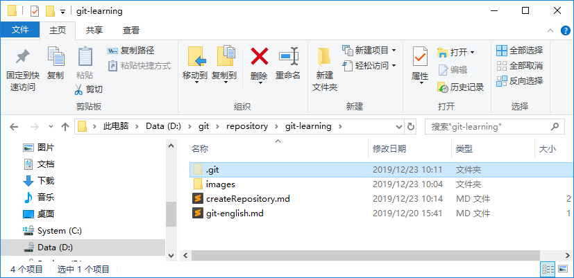
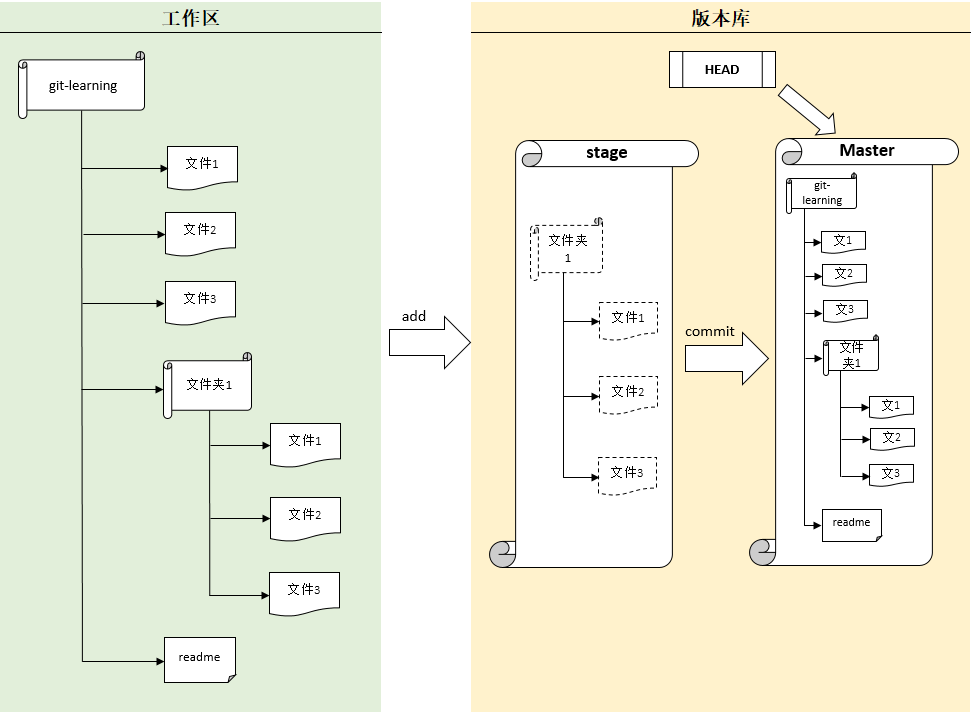
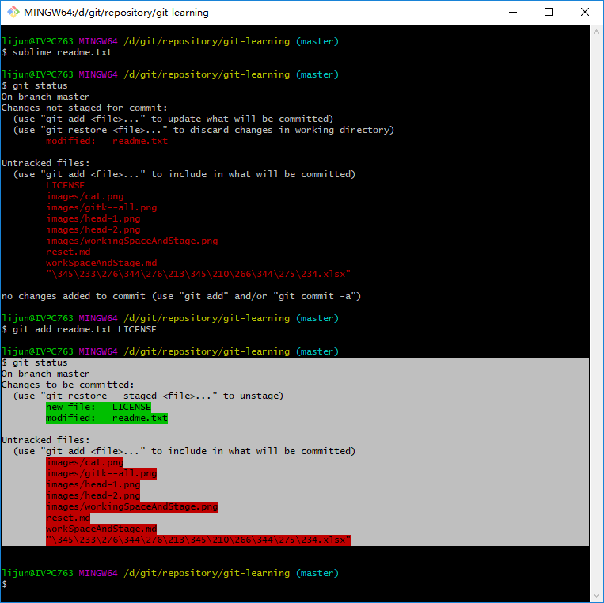
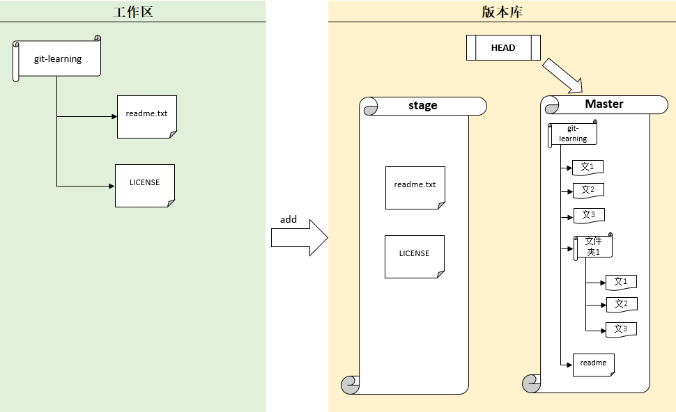
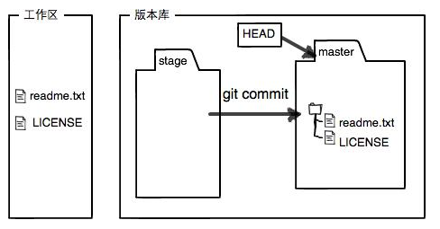

## 工作区和暂存区
Git和其他版本控制系统如SVN的一个不同之处就是有暂存区的概念。   
先来看名词解释。
### 工作区（working Directory）
就是你在电脑里能看到的目录，比如我们现在的<font color="red">`git-learning`</font>文件夹就是一个工作区：   
   

### 版本库（Repository）
工作区有一个隐藏目录<font color="red">`.git`</font>，这个不算工作区，而是Git的版本库。   
Git的版本库里存了很多东西，其中最重要的就是称为stage（或者叫index）的暂存区，还有Git为我们自动创建的第一个分支<font color="red">`master`</font>，以及指向<font color="red">`masteer`</font>的一个指针<font color="red">`HEAD`</font>    
   
分支和<font color="red">`HEAD`</font>的概念我们以后讲。   
前面将了我们吧文件往Git版本库里添加的时候，是分两步执行的：

- 第一步是<font color="red">`git add`</font>把文件添加进去，实际上就是把文件修改添加到暂存区。
- 第二步就是用<font color="red">`git commit`</font>提交更改，实际上就是把暂存区的所有内容提交到当前分支。
   
因为我们创建Git库时，Git自动为我们创建了唯一一个<font color="red">`master`</font>分支，所以，现在，<font color="red">`git commit`</font>就是往<font color="red">`master`</font>分支上提交更改。   
你可以简单理解为，需要提交的文件修改通通放到暂存区，然后，一次性提交暂存区的所有修改。   
俗话说，实践出真知。现在，我们再练习一遍，先对<font color="red">`readme.txt`</font>做个修改，比如加上一行内容：
```bash
Git is a distributed version control system.
Git is free software distributed under the GPL.
Git has a mutable index called stage.
```
然后，在工作区新增一个<font color="red">`LICENSE`</font>文本文件（内容随便）。   
然后通过命令<font color="red">`git status`</font>查看一下状态：
```bash
$ git status
On branch master
Changes not staged for commit:
  (use "git add <file>..." to update what will be committed)
  (use "git restore <file>..." to discard changes in working directory)
        modified:   readme.txt

Untracked files:
  (use "git add <file>..." to include in what will be committed)
        LICENSE
        images/cat.png
        images/gitk--all.png
        images/head-1.png
        images/head-2.png
        images/workingSpaceAndStage.png
        reset.md
        workSpaceAndStage.md
        "\345\233\276\344\276\213\345\210\266\344\275\234.xlsx"

no changes added to commit (use "git add" and/or "git commit -a")
```
其他的几个可以先忽略，我们重点确认下学习内容所关注的<font color="red">`readme.txt`</font>和<font color="red">`LICENSE`</font>两个文件。   
Git非常清楚的告诉我们，<font color="red">`readme.txt`</font>被修改了，而<font color="red">`LICENSE`</font>还从来没有被添加过（git add），所以它的状态时<font color="red">`Untracked`</font>。   
现在，使用两次命令<font color="red">`git add`</font>，把<font color="red">`readme.txt`</font>和<font color="red">`LICENSE`</font>都添加后，用<font color="red">`git status`</font>再查看一下：
```bash
$ git status
On branch master
Changes to be committed:
  (use "git restore --staged <file>..." to unstage)
        new file:   LICENSE
        modified:   readme.txt

Untracked files:
  (use "git add <file>..." to include in what will be committed)
        images/cat.png
        images/gitk--all.png
        images/head-1.png
        images/head-2.png
        images/workingSpaceAndStage.png
        reset.md
        workSpaceAndStage.md
        "\345\233\276\344\276\213\345\210\266\344\275\234.xlsx"
```
   
现在工作区就变成这样了：   
   

所以，<font color="red">`git add`</font>命令实际上就是把要提交的所有修改放到暂存区（Stage），然后，执行<font color="red">`git commit`</font>就可以一次性把暂存区所有修改提交到分支。
```bash
$ git commit -m'understand how stage works'
[master 15a0f9e] understand how stage works
 3 files changed, 3 insertions(+), 1 deletion(-)
 create mode 100644 LICENSE
 create mode 100644 "\345\233\276\344\276\213\345\210\266\344\275\234.xlsx"
```
>不用在意insertions(+)和deletions(-)的数字，我这里是多提交了1个图例的文件，也想要Git帮我管理起来。   

一旦提交后，如果你又没有对工作区做任何修改，那么工作区就是“干净”的：
```bash
$ git status
On branch master
nothing to commit, working tree clean
```
现在版本库就变成这样了：   
   

### 小结

- 暂存区是Git非常重要的概念，弄明白了暂存区，就弄明白了Git的很多操作到底在干什么了。
- 没弄明白暂存区是怎么回事的童鞋，请从上往下，再看一次。